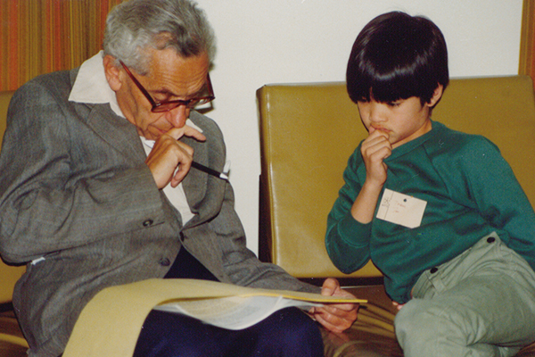

# awesome-1729
A curated list of awesome numbers

Paul Erdos: 
> “I know numbers are beautiful. If they aren't beautiful, nothing is.”

# 1729
[G. H. Hardy](https://en.wikipedia.org/wiki/G._H._Hardy): 
> “I had ridden in taxi cab number 1729 and remarked that the number seemed to me rather a dull one.”

[Srinivasa Ramanujan](https://en.wikipedia.org/wiki/Srinivasa_Ramanujan): 
> “No, it is a very interesting number; it is the smallest number expressible as the sum of two cubes in two different ways.”

[John Edensor Littlewood](https://en.wikipedia.org/wiki/John_Edensor_Littlewood):
> “Every positive integer was one of Ramanujan’s personal friends.”

Have some fun: compute and display the lowest 25 taxicab numbers in [C](https://github.com/Musti1729/awesome-1729/blob/master/Codes/1729Taxicab/Taxicab25.c) and [PARI/GP](https://github.com/Musti1729/awesome-1729/blob/master/Codes/1729Taxicab/Taxicab25.gp)

# 42

Hey Deep Thought! What is the the answer to life, the universe, and everything?

The real answer is Blockchain? What was the question?

Some fun: The number 42 in ASCII is [*](http://www.linfo.org/wildcard.html)

# 0 (TODO)
